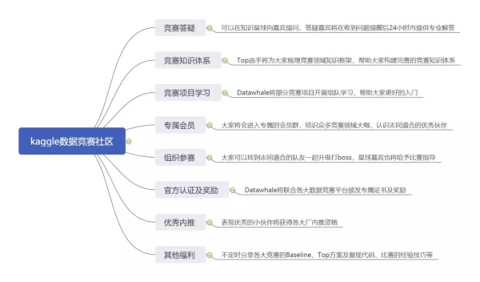
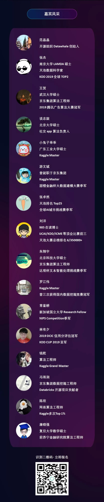

## 知乎专栏：zhuanlan.zhihu.com/DataAI 机器学习理论与数据竞赛实战
## Tencent2019_Finals_Rank1st
# 2019腾讯广告算法大赛完整代码（冠军）

## 数据下载
``` 
链接：https://pan.baidu.com/s/1O5aOkQ_gVOuT1jkC8NFb9g 
提取码：biv9 
``` 
## 1.环境配置和所需依赖库
- scikit-learn
- tqdm
- lightgbm
- pandas
- numpy
- scipy
- tensorFlow=1.12.0 (其他版本≥1.4且不等于1.5或1.6)
- Linux Ubuntu 16.04, 128G内存，一张显卡

## 2.复现结果
原始数据统一保存在data文件夹,包括复赛AB榜数据(不要有子目录)。
``` shell
bash run.sh
```
最后输出结果为./submission.csv

## 3.步骤说明
（1）原始数据统一保存在data文件夹,包括复赛AB榜数据(不要有子目录)。
（2）run.sh会依次运行文件夹A、gdy、wh和lyy中的run.sh文件。
（3）A、gdy和wh会分别从data中读取原始数据，提取特征，然后生成结果。
（4）lyy文件夹用来对gdy和wh产出的结果进行融合，然后得到最终的提交结果。


## 4.特征说明
（1）特征维度：主要从历史角度和全局角度去构建特征，具体维度有前一天、最近一天、历史所有、前n天和五折交叉统计全局特征。
（2）基础特征：广告在当天的竞争胜率，广告在当天竞争次数，广告在当天竞争胜利次数，广告在当天竞争失败次数。然后可以扩展为商品id和账户id等。然后将基础特征按特征维度进行构造。对于新广告，可以将商品id和账户id与基础特征进行组合。


## 5.模型说明
### （1）目录A
#### 模型: lightgbm
```python
    参数：  lgb_model = lgb.LGBMRegressor( num_leaves=256, reg_alpha=0., reg_lambda=0.01, objective='mae', metric=False,max_depth=-1, learning_rate=0.03,min_child_samples=25,  n_estimators=1000, subsample=0.7, colsample_bytree=0.45)
```
### （2）目录gdy 
#### 模型: Xdeepfm https://arxiv.org/pdf/1803.05170.pdf
#### 模型: lightgbm

### （3）目录wh
#### 模型: lightgbm
```python
    参数：  lgb_params = {'num_leaves': 2**7-1,
              'min_data_in_leaf': 25, 
              'objective':'regression_l2',
              'max_depth': -1,
              'learning_rate': 0.1,
              'min_child_samples': 20,
              'boosting': 'gbdt',
              'feature_fraction': 0.6,
              'bagging_fraction': 0.9,
              'bagging_seed': 11,
              'metric': 'mae',
              'seed':1024,
              'lambda_l1': 0.2}
```

### 竞赛社区（知识星球）
```
近期我们公众号和国内的开源组织Datawhale还有杰少一起成立了一个数据竞赛知识星球，并且邀请了国内的很多知名实战高手和赛圈的大佬，在推出的三天中也已经有了500多的用户报名，如果你真的对实战感兴趣而且希望好好学习的话，欢迎通过扫描下面的二维码进行报名，这样可以帮助您省下9元的报名费用，

【Kaggle数据竞赛】
```


```
【适合群体】
1. 对数据竞赛特别感兴趣的你
2. 想在数据科学领域一展拳脚的你
3. 学习了一堆理论但缺乏实践的你
4. 想找工作但缺乏相关项目的你
5. 想结识更多优秀同伴和竞赛大佬

【星球嘉宾】
```

```
